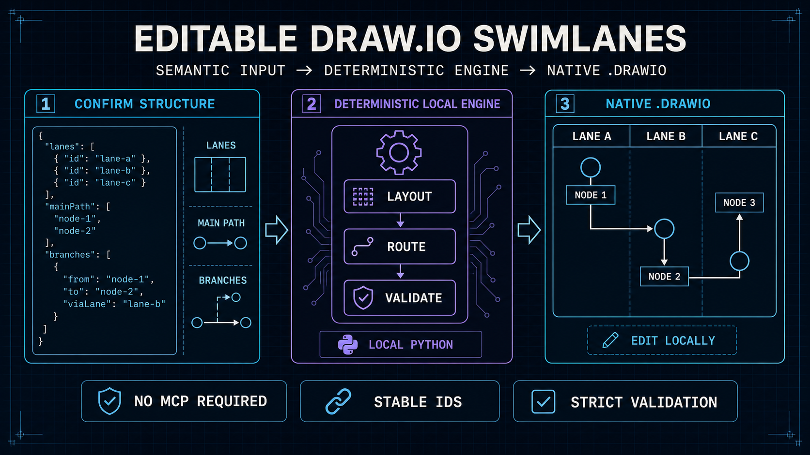

# product-swimlane-drawio

[English](README.md) | [简体中文](README.zh-CN.md)

[](LICENSE)
[](https://www.python.org/)
[](https://agentskills.io/)
[](https://code.claude.com/docs/en/plugin-marketplaces)
[](https://developers.openai.com/codex/)



**Editable product swimlanes that survive the next revision.**

`product-swimlane-drawio` turns a confirmed product or business process into a native `.drawio` file. The agent handles semantics; a deterministic local engine handles layout, routing, validation, and safe incremental updates. Your latest locally saved Draw.io file remains the canonical source.

**Semantic → Deterministic → Editable → Incremental → Validated**

Generation requires neither Draw.io MCP nor the Draw.io application. Draw.io Desktop or diagrams.net is only needed when you want to visually edit or export the result.

**Quick navigation:** [Why this exists](#why-this-exists) · [Example](#see-it-in-action) · [Quick start](#30-second-quick-start) · [Install](#install) · [Use](#ask-an-agent) · [Incremental editing](#edit--inspect--patch) · [Validation](#validation-and-reliability) · [Scope](#supported-scope) · [Development](#development)

## Why this exists

A language model is good at understanding owners, order, decisions, and returns. It is less reliable when asked to invent every coordinate and connector waypoint directly in Draw.io XML.

| Direct AI-generated XML | `product-swimlane-drawio` |
|---|---|
| Semantics and geometry are mixed in one fragile output | The process is first captured as a strict semantic model |
| Layout and routes vary between generations | A deterministic engine rebuilds the same input consistently |
| Manual edits are easily discarded | Stable IDs and geometry-aware patches preserve compatible local edits |
| A file opening successfully is treated as proof | Strict diagnostics and visual review are reported separately |

The result is built for the common product workflow: **AI creates the first 80%, a person adjusts it locally, and later revisions preserve the work already done.**

## What you get

- **Editable:** native, uncompressed `.drawio`; full-height vertical lanes; local drag-and-drop editing.
- **Reliable:** confirmed main path; deterministic layout; orthogonal routing; separate return and retry channels; phase bands.
- **Maintainable:** stable semantic IDs; `inspect`, `patch`, and `compare`; geometry-preserving defaults; safe deletion rules.
- **Verifiable:** strict schema; structured diagnostics; routing and label checks; atomic output receipts with SHA-256.

## See it in action


The fictional [request review example](examples/request-review/) uses the v3 `approval-loop` pattern with four lanes, one decision, a compact rework loop, long-form spacing, and a phase rail. It includes the [prompt](examples/request-review/prompt.md), [semantic specification](examples/request-review/process.json), and exported [preview](examples/request-review/preview.png).

The semantic specification deterministically generates a native editable `.drawio` file locally and passes strict validation with zero warnings. Generated `.drawio` files stay outside the repository; the committed PNG is the GitHub-ready preview.

## 30-second quick start

Install the Skill:

```bash
npx skills add zz-zed/product-swimlane-drawio
```

Then ask your agent:

```text
Use product-swimlane-drawio to create an editable vertical swimlane diagram.
First confirm the lane order, main path, branches, returns, and assumptions.
Do not generate files until I approve the structure.
```

## Install

All installation paths use the same canonical Skill under `skills/product-swimlane-drawio`. Python 3.10+ is required at runtime; Node.js is needed only when installing with `npx skills`.

### Manual installation

#### Agent Skills

```bash
npx skills add zz-zed/product-swimlane-drawio
```

The installer detects compatible agents and asks where to install. Add `-g` for a shared user-level installation. The repository contains one Skill, so no `--skill` argument is needed.

#### Claude Code Plugin Marketplace

Run inside Claude Code:

```text
/plugin marketplace add zz-zed/product-swimlane-drawio
/plugin install product-swimlane-drawio@product-swimlane-drawio
```

#### Codex Plugin Marketplace

```bash
codex plugin marketplace add zz-zed/product-swimlane-drawio
codex plugin add product-swimlane-drawio@product-swimlane-drawio
```

### Agent-assisted installation

Tell Codex, Claude Code, or another Agent Skills-compatible coding agent:

> Please install `product-swimlane-drawio` from `github.com/zz-zed/product-swimlane-drawio`. Prefer this agent's native Plugin Marketplace; otherwise use `npx skills`.

The agent may ask for the installation scope and permission before running commands.

### Verify installation

Use `npx skills list` for a project installation or `npx skills list -g` for a user-level installation. Marketplace installations can be checked with `claude plugin list` or `codex plugin list`.

## Ask an agent

For a new process:

```text
Use product-swimlane-drawio to turn this process into an editable Draw.io swimlane.
Confirm the participants, normal path, decisions, exception paths, and completion state first.
After I approve, build, strictly validate, export a preview, and report visual-review status separately.
```

For an existing compatible diagram:

```text
Use product-swimlane-drawio to update this .drawio file.
Treat the latest saved file as canonical. Preserve unrelated geometry and manual waypoints.
Apply only the requested semantic changes, then strictly validate and compare the result.
```

## How it works

```text
Natural-language process
        ↓ confirm semantics
Versioned JSON model
        ↓ deterministic build
Native editable .drawio
        ↓ strict validation + preview
Local human editing
        ↓ inspect latest file
Geometry-preserving semantic patch
```


The engine supports a confirmed top-to-bottom main path, decisions, cross-lane calls, returns, retries, same-rank interactions, and optional horizontal phases. It routes the main path first and keeps exceptional traffic visually distinct where geometry allows.

## Edit → inspect → patch

Local editing is part of the design, not an escape hatch.

1. Open the generated `.drawio` in Draw.io Desktop or diagrams.net.
2. Adjust wording, node positions, lane sizes, or connectors and save the file.
3. Give the latest saved file back to the agent.
4. The agent runs `inspect`, checks the artifact state, binds the patch to the reported input SHA-256, prepares the smallest semantic patch, preserves unrelated geometry, validates, and compares the result.

Safe patching depends on semantic metadata, a matching semantic-model hash, stable IDs, and the exact inspected input file. Reviewed direct semantic edits can establish a new baseline explicitly; malformed or manually created `.drawio` files may require migration or a controlled rebuild. Explicit manual waypoints are never silently simplified.

## Validation and reliability

Strict validation checks the semantic model, main-path continuity, decisions, retries, phases, fixed-aspect nodes, text fit, ports, lane-boundary clearance, node crossings, short segments, excessive bends, hairpins, reciprocal ambiguity, label placement, connector overlap, and phase Z-order.


Automated validation and visual review are different evidence:

| Review capability | What it supports | Required disclosure |
|---|---|---|
| Text-only agent | Structural and routing confidence from strict validation | Report model visual review as `not_available` |
| Multimodal agent | Additional inspection for clipping, collisions, hidden arrows, and excessive detours | Report validation, preview export, and visual review separately |
| Multimodal agent plus human review | Recommended before important publication or operational use | Review the final exported preview and retain the editable source |

This project does **not** claim a measured accuracy percentage for model-produced diagrams. A successful preview export is not proof that a model inspected the image, and multimodal review can still miss defects.

## Supported scope

| Supported | Not a goal |
|---|---|
| Editable product and business vertical swimlanes | General-purpose diagram generation |
| Roles or systems as lanes | Strict BPMN conformance |
| Main paths, decisions, branches, returns, and retries | UML, C4, ERD, network, or infrastructure topology |
| New diagrams and safe updates to compatible diagrams | Free-form presentation graphics |

## Architecture and design principles

Read [Architecture](docs/architecture.md) for the component and data-flow model, and [Design principles](docs/design-principles.md) for the decisions that keep semantic generation, deterministic rendering, local editing, and validation separate. Maintainers can continue with [Process IR v3](docs/PROCESS_IR_V3.md), the [Layout contract](docs/LAYOUT_CONTRACT_V3.md), the [Round-trip contract](docs/ROUND_TRIP_CONTRACT.md), and the [Benchmark plan](docs/BENCHMARK_PLAN.md).

## Use the local tool directly

```bash
python3 skills/product-swimlane-drawio/scripts/drawio_swimlane.py \
  build --spec process.json --output process.drawio --strict

python3 skills/product-swimlane-drawio/scripts/drawio_swimlane.py \
  validate --input process.drawio --strict

python3 skills/product-swimlane-drawio/scripts/drawio_swimlane.py \
  inspect --input process.drawio
```

Patch and compare:

```bash
python3 skills/product-swimlane-drawio/scripts/drawio_swimlane.py \
  patch --input process.drawio --expected-input-sha256 "<sha256-from-inspect>" --changes changes.json --output process-updated.drawio --strict

python3 skills/product-swimlane-drawio/scripts/drawio_swimlane.py \
  compare --before process.drawio --after process-updated.drawio --changes changes.json
```

See the [semantic schema and patch contract](skills/product-swimlane-drawio/references/schema.md).

## Development

```bash
python3 -m unittest discover -s tests -v
npx skills add . --list
claude plugin validate .
```

The Claude manifest intentionally omits `version` because the target marketplace owns it; Claude's validator may emit a non-blocking recommendation. See [CONTRIBUTING.md](CONTRIBUTING.md) for contribution requirements.

## Security and privacy

The Skill runs local scripts with the invoking agent's permissions. Review the Skill and scripts before installation. The published Skill package contains no user data, organization names, proprietary terminology, generated diagrams, or domain-specific sample flows. Task artifacts belong outside the Skill directory.

See [SECURITY.md](SECURITY.md) for vulnerability reporting.

## License

Released under the [MIT License](LICENSE). Draw.io and diagrams.net are third-party products; this project is not affiliated with or endorsed by their maintainers.
