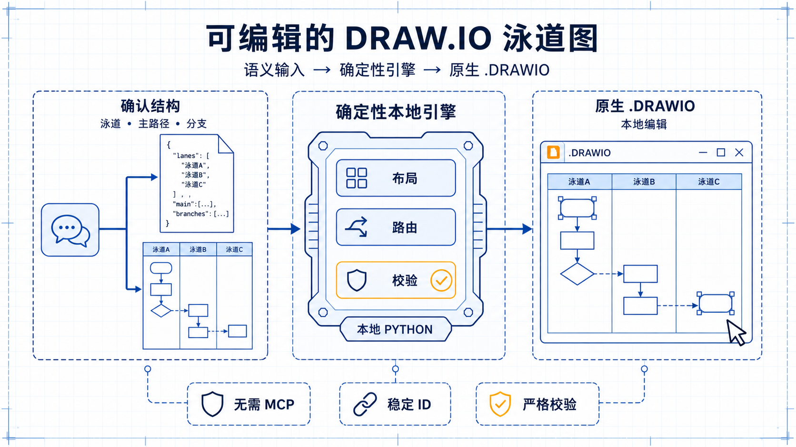
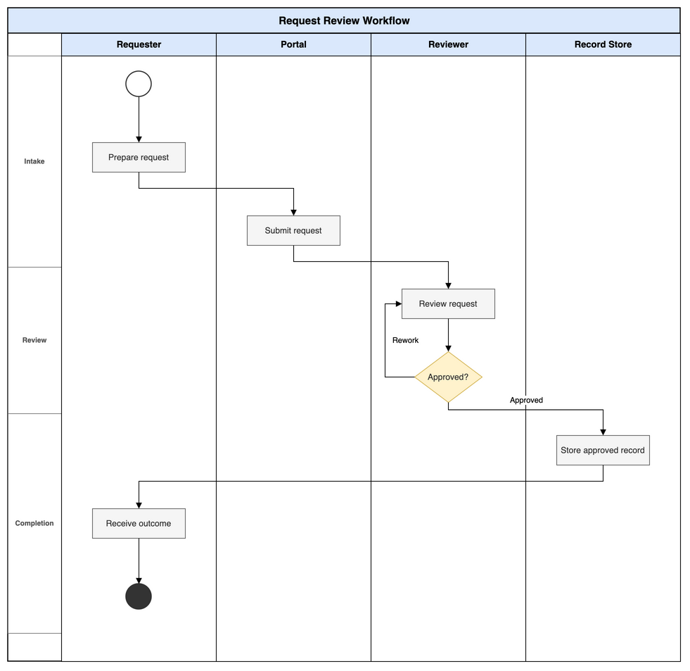
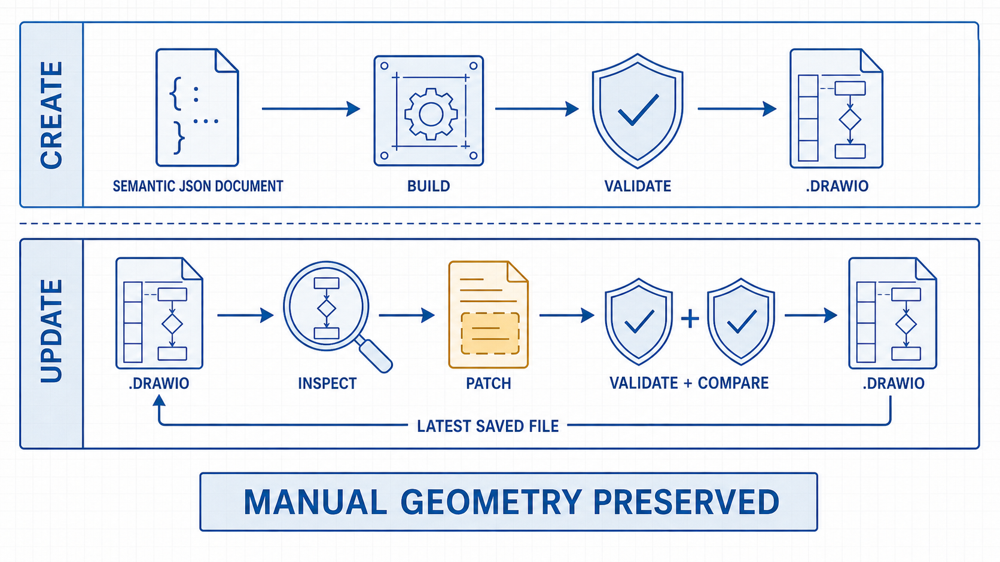
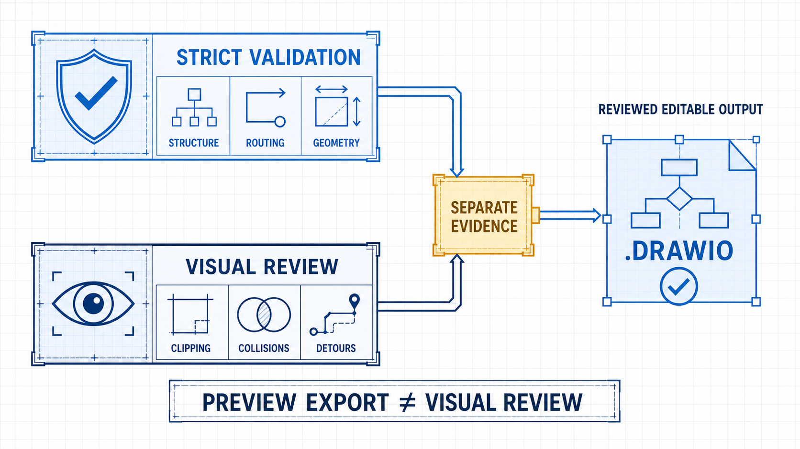

# product-swimlane-drawio

[English](README.md) | [简体中文](README.zh-CN.md)

[](LICENSE)
[](https://www.python.org/)
[](https://agentskills.io/)
[](https://code.claude.com/docs/en/plugin-marketplaces)
[](https://developers.openai.com/codex/)



**经得起下一次修改的可编辑产品泳道图。**

`product-swimlane-drawio` 将已确认的产品或业务流程转换为原生 `.drawio` 文件。Agent 负责理解流程语义，确定性本地引擎负责布局、路由、校验和安全的增量修改；用户最近一次在本地保存的 Draw.io 文件始终是后续修改的权威来源。

**语义化 → 确定性 → 可编辑 → 可迭代 → 可验证**

生成过程不依赖 Draw.io MCP，也不要求安装 Draw.io 应用。只有需要可视化编辑或导出时，才需要 Draw.io Desktop 或 diagrams.net。

**快速导航：** [为什么需要](#为什么需要这个-skill) · [完整示例](#查看完整示例) · [快速开始](#30-秒快速开始) · [安装](#安装) · [使用](#让-agent-生成或修改) · [增量修改](#编辑--检查--补丁) · [校验](#校验与输出可靠度) · [适用范围](#适用范围) · [开发](#开发) · [内部发布流程](docs/INTERNAL_RELEASE.md)

## 为什么需要这个 Skill

语言模型擅长理解参与方、流程顺序、判断条件和返回关系，但不擅长在直接生成 Draw.io XML 时同时规划所有坐标与连线折点。

| AI 直接生成 XML | `product-swimlane-drawio` |
|---|---|
| 语义与几何混在一份脆弱输出中 | 先用严格的语义模型表达流程 |
| 每次生成的布局与路由可能不同 | 确定性引擎可稳定重建同一输入 |
| 人工调整容易被后续生成覆盖 | 稳定 ID 与几何感知补丁保留兼容的本地调整 |
| 文件能打开就被当作完成证明 | 严格诊断与视觉检查分别报告 |

它面向产品工作中最常见的闭环：**AI 先完成 80%，人再在本地调整 20%，后续迭代继续保留已经完成的工作。**

## 可以获得什么

- **可编辑：** 原生未压缩 `.drawio`、全高度垂直泳道、本地拖拽编辑。
- **可靠：** 已确认主路径、确定性布局、正交路由、独立返回和重试通道、阶段带。
- **可维护：** 稳定语义 ID、`inspect`、`patch`、`compare`、默认保护几何、安全删除规则。
- **可验证：** 严格 Schema、结构化诊断、路由与标签检查、带 SHA-256 的原子输出收据。

## 查看完整示例



虚构且领域中性的[请求评审示例](examples/request-review/)采用 v3 `approval-loop` 模式，包含四条泳道、一个判断、一条紧凑的返工回路、长流程间距和阶段导航栏。目录中提供了[提示词](examples/request-review/prompt.md)、[语义规格](examples/request-review/process.json)和导出的[预览图](examples/request-review/preview.png)。

语义规格可以在本地确定性生成原生可编辑的 `.drawio` 文件，并通过零警告的严格校验。生成的 `.drawio` 不提交到仓库，GitHub 仅保留可直接引用和展示的 PNG 预览图。

## 30 秒快速开始

安装 Skill：

```bash
npx skills add zz-zed/product-swimlane-drawio
```

然后告诉 Agent：

```text
使用 product-swimlane-drawio 创建一张可编辑的垂直泳道图。
先确认泳道顺序、主路径、分支、返回关系和假设。
在我确认结构之前不要生成文件。
```

## 安装

所有安装方式都使用 `skills/product-swimlane-drawio` 下的同一份 Skill。运行时要求 Python 3.10+；Node.js 只在通过 `npx skills` 安装时需要。

### 手动安装

#### Agent Skills

```bash
npx skills add zz-zed/product-swimlane-drawio
```

安装器会识别兼容的 Agent 并询问安装位置。添加 `-g` 可安装到用户级共享目录。仓库中只有一个 Skill，因此不需要 `--skill` 参数。

#### Claude Code Plugin Marketplace

在 Claude Code 中执行：

```text
/plugin marketplace add zz-zed/product-swimlane-drawio
/plugin install product-swimlane-drawio@product-swimlane-drawio
```

#### Codex Plugin Marketplace

```bash
codex plugin marketplace add zz-zed/product-swimlane-drawio
codex plugin add product-swimlane-drawio@product-swimlane-drawio
```

### 通过 Agent 安装

告诉 Codex、Claude Code 或其他兼容 Agent Skills 的编程 Agent：

> 请从 `github.com/zz-zed/product-swimlane-drawio` 安装 `product-swimlane-drawio`。优先使用当前 Agent 的原生 Plugin Marketplace；不支持时再使用 `npx skills`。

Agent 可能会询问安装范围，并在运行命令前请求授权。

### 验证安装结果

项目级安装使用 `npx skills list`，用户级安装使用 `npx skills list -g`。Marketplace 安装可通过 `claude plugin list` 或 `codex plugin list` 检查。

## 让 Agent 生成或修改

从零生成：

```text
使用 product-swimlane-drawio 将这个流程转换为可编辑的 Draw.io 泳道图。
先确认参与方、正常路径、判断、异常路径和完成状态。
我确认后再生成、严格校验并导出预览，视觉检查状态需要单独报告。
```

修改已有兼容图：

```text
使用 product-swimlane-drawio 修改这个 .drawio 文件。
以最近保存的文件为准，保留无关几何和人工 waypoint。
只应用我要求的语义变更，然后严格校验并对比结果。
```

## 工作原理

```text
自然语言流程
        ↓ 确认语义
版本化 JSON 模型
        ↓ 确定性生成
原生可编辑 .drawio
        ↓ 严格校验 + 预览
人工本地编辑
        ↓ 检查最新文件
保护几何的语义补丁
```



引擎支持已确认的自上而下主路径、判断、跨泳道调用、返回、重试、同顺序交互和可选水平阶段。引擎优先规划主路径，并在几何条件允许时将异常流量放到独立通道。

## 编辑 → 检查 → 补丁

本地编辑是设计的一部分，不是兜底手段。

1. 使用 Draw.io Desktop 或 diagrams.net 打开生成的 `.drawio`。
2. 调整文案、节点位置、泳道尺寸或连线并保存。
3. 将最近保存的文件重新交给 Agent。
4. Agent 运行 `inspect`，检查产物状态，将补丁绑定到返回的输入 SHA-256，准备最小语义补丁，保留无关几何，再校验并对比结果。

安全补丁依赖该 Skill 创建的语义元数据、匹配的语义模型哈希、稳定 ID 和经过检查的准确输入文件。经确认的直接语义编辑可以显式建立新基线；结构异常或手工创建的 `.drawio` 可能需要迁移或受控重建。明确设置的人工 waypoint 不会被静默简化。

## 校验与输出可靠度

严格校验覆盖语义模型、主路径连续性、判断、重试、阶段、固定宽高比节点、文字适配、端口、泳道边界距离、节点穿越、短线段、过多折点、回钩、往返路径混淆、标签位置、连线重叠和阶段层级。



自动校验与视觉检查是两类不同证据：

| 检查能力 | 可以支持什么 | 必须说明 |
|---|---|---|
| 纯文本 Agent | 结构与路由可靠度来自严格校验 | 模型视觉检查报告为 `not_available` |
| 多模态 Agent | 额外检查文字裁切、视觉碰撞、箭头遮挡和过度绕行 | 分别报告严格校验、预览导出和视觉检查 |
| 多模态 Agent 加人工复核 | 重要图形公开发布或投入使用前的推荐方式 | 检查最终预览并保留可编辑源文件 |

本项目**不声明**模型生成流程图具有经过测量的准确率。预览导出成功不代表模型已经检查图片，多模态检查也仍可能漏检问题。

## 适用范围

| 支持 | 不作为目标 |
|---|---|
| 可编辑的产品和业务垂直泳道图 | 通用图形生成 |
| 以角色或系统划分泳道 | 严格 BPMN 合规 |
| 主路径、判断、分支、返回和重试 | UML、C4、ERD、网络或基础设施拓扑 |
| 新建流程和安全修改兼容流程图 | 自由排版的演示图形 |

## 架构与设计原则

[架构说明](docs/architecture.md)介绍组件与数据流；[设计原则](docs/design-principles.md)说明为什么需要将语义生成、确定性渲染、本地编辑和校验彼此分离。维护者可以继续阅读 [Process IR v3](docs/PROCESS_IR_V3.md)、[布局约定](docs/LAYOUT_CONTRACT_V3.md)、[往返编辑约定](docs/ROUND_TRIP_CONTRACT.md)和[基准计划](docs/BENCHMARK_PLAN.md)。

## 直接使用本地工具

```bash
python3 skills/product-swimlane-drawio/scripts/drawio_swimlane.py \
  build --spec process.json --output process.drawio --strict

python3 skills/product-swimlane-drawio/scripts/drawio_swimlane.py \
  validate --input process.drawio --strict

python3 skills/product-swimlane-drawio/scripts/drawio_swimlane.py \
  inspect --input process.drawio
```

补丁和对比：

```bash
python3 skills/product-swimlane-drawio/scripts/drawio_swimlane.py \
  patch --input process.drawio --expected-input-sha256 "<inspect返回的sha256>" --changes changes.json --output process-updated.drawio --strict

python3 skills/product-swimlane-drawio/scripts/drawio_swimlane.py \
  compare --before process.drawio --after process-updated.drawio --changes changes.json
```

详见[语义 Schema 与补丁约定](skills/product-swimlane-drawio/references/schema.md)。

## 开发

```bash
python3 -m unittest discover -s tests -v
npx skills add . --list
claude plugin validate .
```

Claude manifest 按目标市场的版本托管规则有意省略 `version`，因此 Claude 校验器可能给出不阻塞的建议。贡献要求参见 [CONTRIBUTING.md](CONTRIBUTING.md)。

## 安全与隐私

Skill 会使用调用 Agent 当前拥有的权限运行本地脚本。安装前请审阅 Skill 与脚本。公开 Skill 包不包含用户数据、组织名称、专有术语、生成后的流程图或特定领域示例流程。任务产物应放在 Skill 目录之外。

漏洞报告方式参见 [SECURITY.md](SECURITY.md)。

## 许可证

项目采用 [MIT License](LICENSE)。Draw.io 和 diagrams.net 是第三方产品，本项目与其维护方不存在隶属或官方认可关系。
