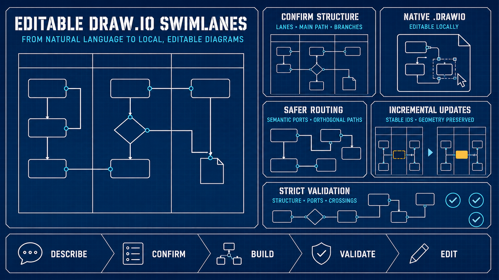

# product-swimlane-drawio

[English](README.md) | [简体中文](README.zh-CN.md)

[](LICENSE)
[](https://www.python.org/)
[](https://agentskills.io/)



根据自然语言创建和增量修改原生、可编辑的 Draw.io 垂直泳道图。

该 Skill 面向每个参与方、角色或系统分别占据一条垂直泳道的流程图，通过结构确认、确定性布局、语义端口、稳定 ID、增量修改和连线质量校验，提高生成结果的清晰度和可维护性。

## 为什么使用这个 Skill

直接生成 Draw.io XML 容易出现连线混乱、回退路径不清晰，以及修改后布局失控等问题。该 Skill 使用中性的 JSON 模型和确定性的本地工具，让流程图更容易评审，也便于后续继续编辑。

- 输出原生、未压缩的 `.drawio` 文件
- 支持全高度垂直泳道
- 使用全局顺序控制自上而下的流程布局
- 支持决策、分支、返回、重试和跨泳道流程
- 通过语义端口和正交路由改善连线质量
- 使用稳定 ID 支持增量修改
- 提供严格的结构与路由质量检查
- 生成过程不依赖 Draw.io
- 可在 Draw.io Desktop 或 diagrams.net 中本地编辑

## 工作流程

```text
自然语言流程描述
        ↓
确认泳道、主流程、分支和假设
        ↓
中性 JSON 规格
        ↓
生成原生 .drawio 文件
        ↓
严格校验和按模型能力执行的视觉检查
        ↓
本地编辑或应用语义补丁
```

## 支持的 Agent

该包遵循 Agent Skills 目录格式，主要面向：

- OpenAI Codex
- Claude Code
- 其他兼容 Agent Skills 的工具，按最佳兼容方式支持

Agent 专属元数据统一放在 `agents/` 目录中；核心流程和 Python 工具不依赖单一 Agent 运行时。

## 环境要求

- Python 3.10 或更高版本
- 兼容 Agent Skills 的编程 Agent
- 可选：用于可视化编辑和导出的 Draw.io Desktop 或 [diagrams.net](https://app.diagrams.net/)

随附的 Python 工具只使用标准库。

## 安装

通过 [`npx skills`](https://github.com/vercel-labs/skills) 为 Codex 和 Claude Code 进行全局安装：

```bash
npx skills add zz-zed/product-swimlane-drawio \
  --skill product-swimlane-drawio \
  -g \
  -a codex \
  -a claude-code
```

安装前检查仓库中的可发现 Skill：

```bash
npx skills add zz-zed/product-swimlane-drawio --list
```

## 通过 Agent 使用

可以要求 Agent 在生成文件前先确认结构：

```text
使用 product-swimlane-drawio 创建一张可编辑的垂直泳道图。
先确认泳道顺序、主流程、分支、返回路径和假设。
在我确认结构之前不要生成文件。
```

对于已有的兼容图，可以使用：

```text
使用 product-swimlane-drawio 修改这个 .drawio 文件。
保留现有节点位置和手工布局调整。
只应用我要求的语义变更，然后校验并对比修改结果。
```

## 直接使用本地工具

生成并校验：

```bash
python3 skills/product-swimlane-drawio/scripts/drawio_swimlane.py \
  build --spec process.json --output process.drawio

python3 skills/product-swimlane-drawio/scripts/drawio_swimlane.py \
  validate --input process.drawio --strict
```

增量修改并对比：

```bash
python3 skills/product-swimlane-drawio/scripts/drawio_swimlane.py \
  patch --input process.drawio --changes changes.json --output process-updated.drawio

python3 skills/product-swimlane-drawio/scripts/drawio_swimlane.py \
  compare --before process.drawio --after process-updated.drawio --changes changes.json
```

语义输入格式参见 [`references/schema.md`](skills/product-swimlane-drawio/references/schema.md)。

## 增量修改的适用边界

安全增量修改依赖该 Skill 生成的语义元数据和稳定 ID。对于手工创建或不兼容的 `.drawio` 文件，可能需要先迁移或受控重建，才能可靠地应用语义补丁。

默认情况下，补丁会保留已有节点位置。只有明确需要移动或缩放节点时，才应启用几何更新命令行参数。

## 校验能力

严格校验会检查结构完整性和路由质量，包括：

- 缺失端点和重复语义 ID
- 节点超出所属泳道
- 非预期端口复用
- 连线与泳道边界重合或距离过近
- 连线穿过节点
- 连线线段重叠、交叉或不满足正交要求

自动校验不能替代视觉检查。必须校验最终保存的 `.drawio` 文件。如果文件经过 Draw.io 打开、编辑、移动或保存，则交付前必须再次执行严格校验。

## 模型能力与输出可靠度

本项目目前没有为模型生成的流程图声明经过测量的准确率。确定性校验和模型视觉检查提供的是两类不同证据。

| Agent 能力 | 相对可靠度 | 必须说明 |
|---|---|---|
| 纯文本模型 | 结构和路由可靠度仅来自严格自动校验，仍可能保留视觉问题。 | 明确说明“未执行模型视觉检查”。 |
| 多模态模型 | 对文字裁切、视觉碰撞、箭头遮挡和过度绕行具有更高的发现概率，但检查结果并非确定性的，仍可能漏检。 | 分别报告自动校验、预览导出和模型视觉检查状态。 |
| 多模态模型加人工复核 | 重要流程图在公开发布或实际使用前的推荐方式。 | 保留可编辑 `.drawio` 文件，并检查最终导出的预览。 |

预览导出成功不等于模型已经检查预览。多模态模型可以提高视觉质量检查的可靠度，但不能替代严格校验，也不能保证流程图完全没有问题。

## 适用范围

该 Skill 用于可编辑的垂直泳道流程图，不用于严格 BPMN 合规建模、基础设施拓扑或自由排版的展示型图形。

## 开发

运行中性测试套件：

```bash
python3 -m unittest discover -s tests -v
```

检查本地 Skill 发现结果：

```bash
npx skills add . --list
```

贡献要求参见 [CONTRIBUTING.md](CONTRIBUTING.md)。

## 安全与隐私

该 Skill 会使用调用 Agent 当前拥有的权限运行本地脚本。安装前请审阅 Skill 指令和脚本内容。

公开包不包含用户数据、组织名称、专有术语、生成后的流程图或特定领域示例流程。任务输入和输出应保存在 Skill 目录之外。

漏洞报告方式参见 [SECURITY.md](SECURITY.md)。

## 许可证

项目采用 [MIT License](LICENSE)。

Draw.io 和 diagrams.net 是第三方产品，本项目与其维护方不存在隶属或官方认可关系。
